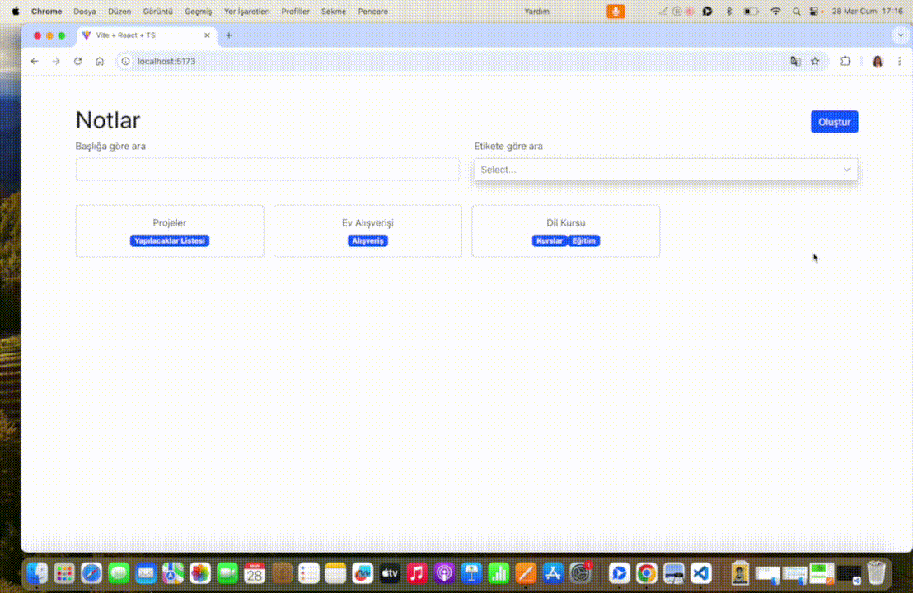

# 📝 Note App TypeScript Project

<li>This project helps users to create notes.</li>
<li>It is built with modern web technologies and includes functions such as listing, editing notes.</li>

## 🚀 Features

🔍 Note Search: Users can list notes by choosing their labels or writing their titles.

✍️ Note Editing: Users can update note content, title and label. They can delete notes.

📱 Responsive Design: With a mobile compatible and stylish design, it can be used easily on any device.

### 👩‍💻 Technologies Used

<li>TypeScript</li>
<li>React + Vite</li>
<li>React-router-dom</li>
<li>React-bootstrap</li>
<li>React-select</li>
<li>uuid</li>
<li>Css</li>
<li>Bootstrap</li>

### 🌐 `Deploy`

### 🎥 `Screen`

# Note-App-TypeScript-Project
